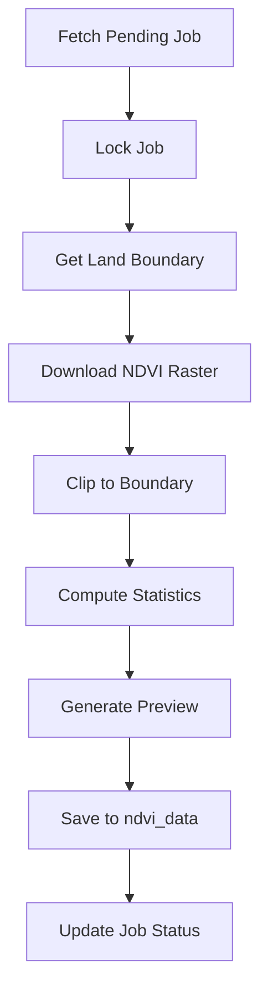

# Land Clipper Worker

Production-ready worker for clipping tile-level NDVI rasters to individual land boundaries for KisanShakti AI platform.

## Architecture

- **Python Worker**: Processes land clipping jobs from queue
- **GDAL/Rasterio**: Handles geospatial operations
- **Supabase Backend**: Job queue, land boundaries, NDVI data storage
- **Docker Container**: Deployment-ready container

## Quick Start

### 1. Database Setup
The migration has already been applied adding:
- Stats columns to `ndvi_data` table
- Indexes for performance
- Job processing optimizations

### 2. Build and Deploy

```bash
# Build Docker image
cd ndvi-harvest-worker
docker build -f land_clipper.Dockerfile -t land-clipper .

# Run locally for testing
docker run --env-file .env land-clipper --max-jobs 1

# Deploy to Cloud Run
gcloud run deploy land-clipper \
  --image gcr.io/PROJECT/land-clipper \
  --set-env-vars SUPABASE_URL=$SUPABASE_URL,SUPABASE_SERVICE_KEY=$KEY \
  --memory 1Gi \
  --timeout 300 \
  --max-instances 10
```

### 3. Environment Variables

```env
SUPABASE_URL=https://your-project.supabase.co
SUPABASE_SERVICE_KEY=your-service-key
```

### 4. CLI Usage

```bash
# Process single job
python3 land_clipper_worker.py --max-jobs 1

# Process multiple jobs
python3 land_clipper_worker.py --max-jobs 10

# Run continuously
python3 land_clipper_worker.py --continuous --max-jobs 5
```

## Integration with NDVI Harvest Worker

The Land Clipper Worker processes jobs created by the NDVI Harvest Worker:

1. **Harvest Worker** downloads Sentinel-2 tiles and creates NDVI rasters
2. **Harvest Worker** creates `land_clipping` jobs in `system_jobs` table
3. **Land Clipper** picks up jobs and clips rasters to land boundaries
4. **Land Clipper** computes stats and stores in `ndvi_data` table

## Job Processing Flow



## Statistics Computed

- **min_ndvi**: Minimum NDVI value in land
- **max_ndvi**: Maximum NDVI value in land  
- **mean_ndvi**: Average NDVI value (used as primary metric)
- **valid_pixels**: Number of non-cloudy pixels
- **total_pixels**: Total pixels in land boundary
- **coverage_percentage**: Percentage of valid data

## Error Handling

- **No Valid Pixels**: Job marked failed if land is fully cloudy
- **Missing Boundary**: Job failed if land boundary not found
- **Download Failures**: Retried 3 times with exponential backoff
- **Database Errors**: Job status preserved for manual retry

## Performance Optimizations

- **Streaming**: Processes rasters in memory without local disk
- **Parallel Processing**: Multiple workers can run simultaneously
- **Job Locking**: Prevents duplicate processing
- **Indexed Queries**: Fast job fetching and data updates

## Monitoring

Check job status:
```sql
-- View pending jobs
SELECT * FROM system_jobs 
WHERE job_type = 'land_clipping' 
AND status = 'pending'
ORDER BY created_at;

-- Check failed jobs
SELECT * FROM system_jobs
WHERE job_type = 'land_clipping'
AND status = 'failed'
AND created_at > now() - interval '1 day';

-- Monitor processing rate
SELECT 
  date_trunc('hour', completed_at) as hour,
  COUNT(*) as jobs_completed,
  AVG(EXTRACT(EPOCH FROM (completed_at - started_at))) as avg_duration_seconds
FROM system_jobs
WHERE job_type = 'land_clipping'
AND status = 'completed'
GROUP BY hour
ORDER BY hour DESC;
```

## Cron Schedule

Run workers on schedule to process jobs:

```cron
# Process land clipping jobs every 15 minutes
*/15 * * * * docker run land-clipper --max-jobs 50

# Or run continuous workers
@reboot docker run -d land-clipper --continuous --max-jobs 10
```

## Preview Images

Optional PNG previews are generated with:
- Color ramp: Red (low) → Yellow (medium) → Green (high NDVI)
- Stored in `land-previews/{land_id}/{date}/ndvi_preview.png`
- Linked in `ndvi_data.image_url` for map overlays

## Security

- Service role key required for database access
- Tenant isolation enforced in queries
- Signed URLs for storage access (1hr expiry)
- Job locking prevents race conditions

## Troubleshooting

1. **Jobs Stuck in Running**: Check worker logs, may need manual reset
2. **High Memory Usage**: Reduce `--max-jobs` parameter
3. **Slow Processing**: Check raster sizes, consider downsampling
4. **Preview Generation Fails**: Matplotlib optional, doesn't affect stats

## Testing

```python
# Unit test for clipping function
def test_clip_raster():
    # Create sample raster
    # Create sample polygon
    # Test clipping
    # Verify statistics
    pass

# Integration test
def test_full_pipeline():
    # Create test job
    # Run worker
    # Verify ndvi_data updated
    pass
```

## Cost Control

- Process during off-peak hours for lower compute costs
- Batch jobs by geographic proximity
- Skip preview generation for cost savings
- Monitor storage usage for generated previews